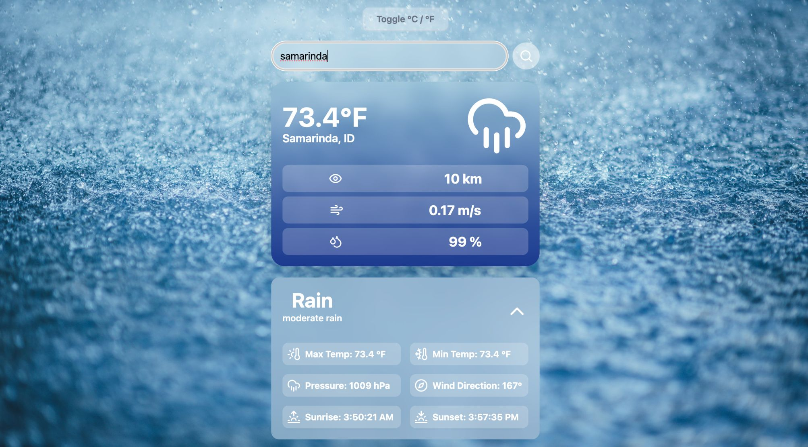
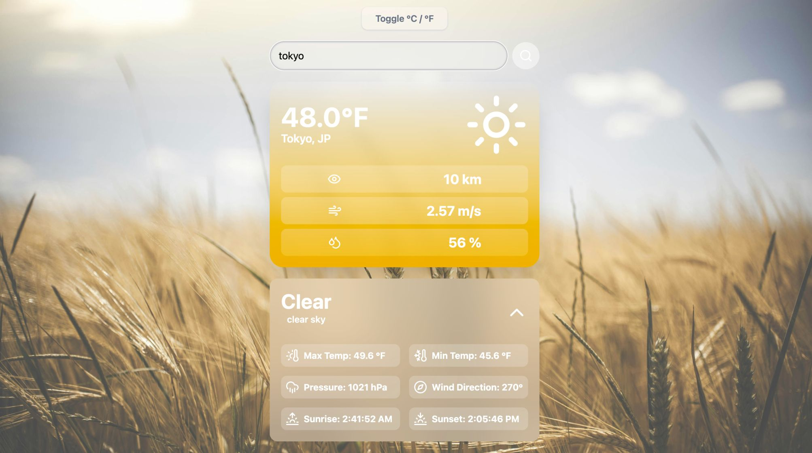
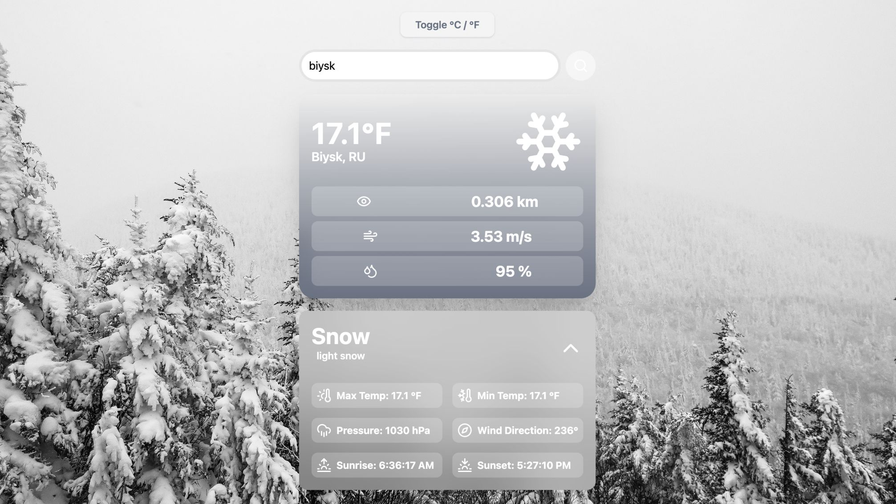

# Weather App

## Site link : https://weathertsapp.netlify.app/

## Overview
This is a React and TypeScript weather application that fetches real-time weather data using the OpenWeather API. It provides weather details such as temperature, wind speed, humidity, and includes a global toggle feature to switch between Celsius and Fahrenheit. The UI is built with Tailwind CSS and features dynamic backgrounds and icons based on weather conditions.

## Features
- Search for any city to get real-time weather updates
- Global temperature toggle (Celsius ↔ Fahrenheit)
- Weather details including wind speed, humidity, pressure, and visibility
- Dynamic backgrounds and icons based on weather conditions
- Expandable dropdown for additional weather details
- Error handling with toast notifications
- Modern UI with Tailwind CSS

## Technologies Used
- React with TypeScript
- Tailwind CSS
- OpenWeather API
- Axios for API requests
- React Toastify for notifications
- Lucide Icons for weather representation

## Project Structure
```
/weather-app/
│── src/
│   ├── components/
│   │   ├── WeatherCard.tsx
│   │   ├── WeatherDetails.tsx
│   │   ├── SearchBar.tsx
│   ├── App.tsx
│   ├── main.tsx
│── public/
│── index.html
│── package.json
│── tsconfig.json
│── vite.config.ts
│── .env
```

## Installation and Setup

### 1. Clone the Repository
```sh
git clone https://github.com/anuj-consultadd/Weather_app.git
cd weather-app
```

### 2. Install Dependencies
```sh
npm install
```

### 3. Configure Environment Variables
Create a `.env` file in the root directory and add the following line:
```sh
VITE_WEATHER_API_KEY=your_api_key_here
```
Replace `your_api_key_here` with a valid API key from OpenWeather.

### 4. Start the Development Server
```sh
npm run dev
```

## Usage
1. Enter a city name in the search bar and press enter.
2. View real-time weather data and corresponding icons.
3. Use the toggle button to switch between Celsius and Fahrenheit.
4. Click the dropdown button to reveal additional weather details.
5. If an incorrect city is entered, a toast notification will display an error message.

## Environment Variables
The `.env` file should contain:
```sh
VITE_WEATHER_API_KEY=your_api_key_here
```
Ensure you have registered for an OpenWeather API key at [OpenWeather API](https://openweathermap.org/api).

## Dependencies
```json
"dependencies": {
    "@tailwindcss/vite": "^4.0.9",
    "@types/react-toastify": "^4.0.2",
    "axios": "^1.8.1",
    "lucide-react": "^0.476.0",
    "react": "^19.0.0",
    "react-toastify": "^11.0.5",
    "tailwindcss": "^4.0.9",
  },
```

## Preview





---
Developed by Anuj Jaiswal

